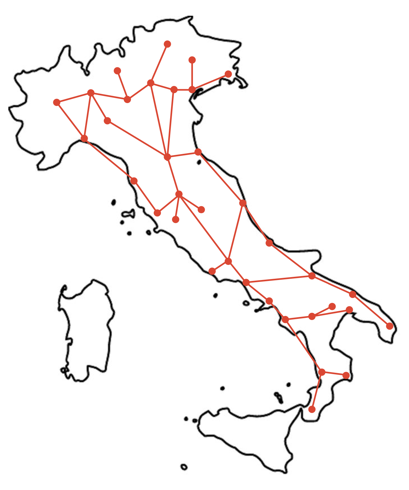
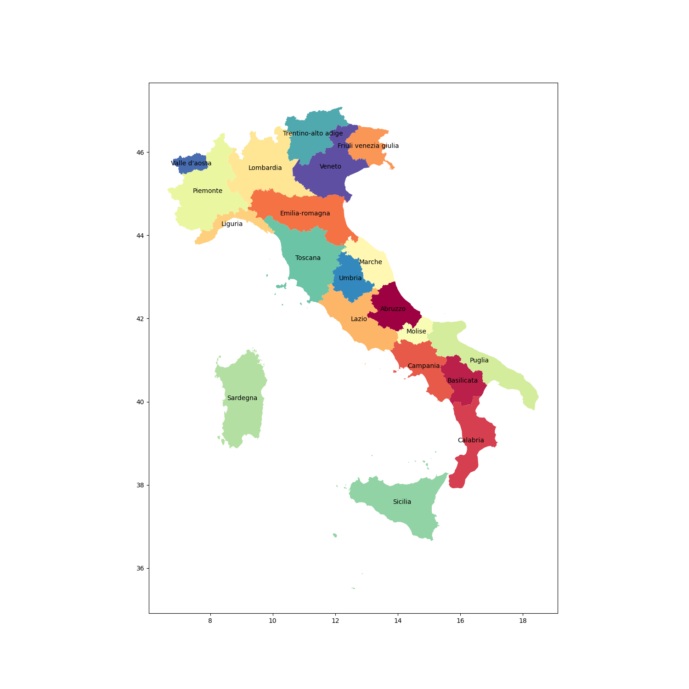
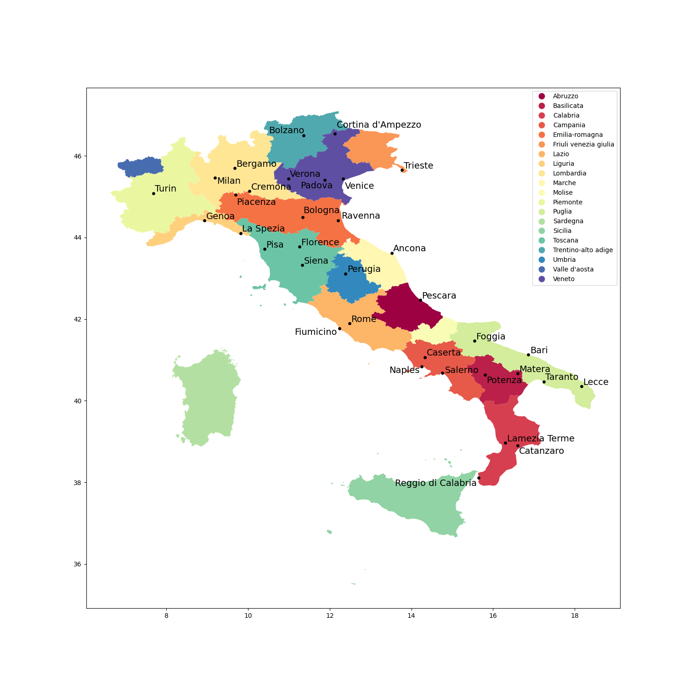

# Italian Train Route Selector
### Connor Eastman

This OOP project recreates a network of 35 Italian cities which are connected by major railway systems and uses Dijkstra's shortest path algorithm 
to find the shortest path between 2 user picked cities via rail network. The vertices for the graph are stored in a hashtable for efficient memory 
storage. City and Path objects are used to hold internal City info and path data sequence information for ease of access. 

#### List of Cities in Network:
|                    |            |                    |                         |                |
| ------------------ | ---------- | -------------------| ----------------------- | -------------- |
| Ancona             | Bari       | Bergamo            | Bologna                 | Bolzano        |
| Caserta            | Catanzaro  | Cortina d'Ampezzo  | Fiumicino               | Florence       |
| Foggia             | Genoa      | La Spezia          | Lamezia Terme           | Lecce          |
| Matera             | Milan      | Naples             | Padova                  | Perugia        |
| Pescara            | Piacenza   | Pisa               | Potenza                 | Ravenna        |
| Reggio di Calabria | Rome       | Solerno            | San Giorgio a Cremano   |  Siena         |
| Taranto            | Trieste    | Turin              | Venice                  | Verona         |

#### Planning out Network
 

#### Maps of Italy
  

___

All rail connections/network and distances gathered on [rome2rio](https://www.rome2rio.com/)  
All City Region and population information gathered on [City Population](https://www.citypopulation.de/en/italy/)  
City Location and Map data gathered from [Simple Maps](https://simplemaps.com/data/it-cities)  
Geojson files downloaded from [www.cartographyvectors.com](https://cartographyvectors.com/map/1458-italy-with-regions)   
___

